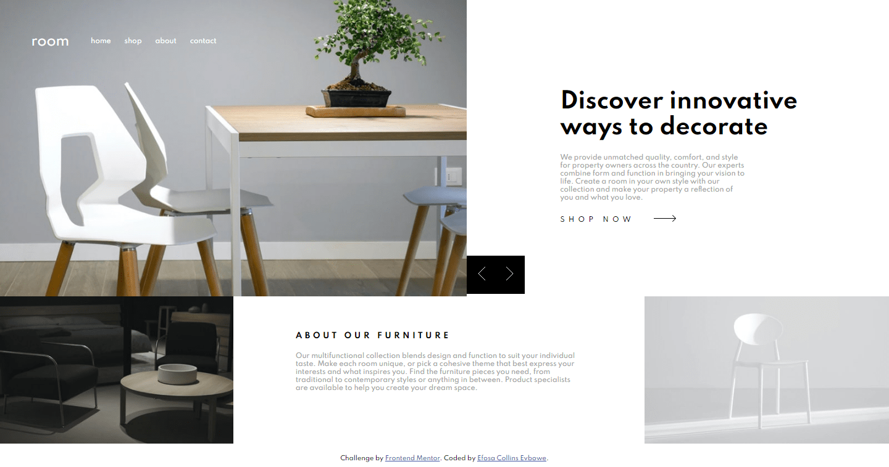
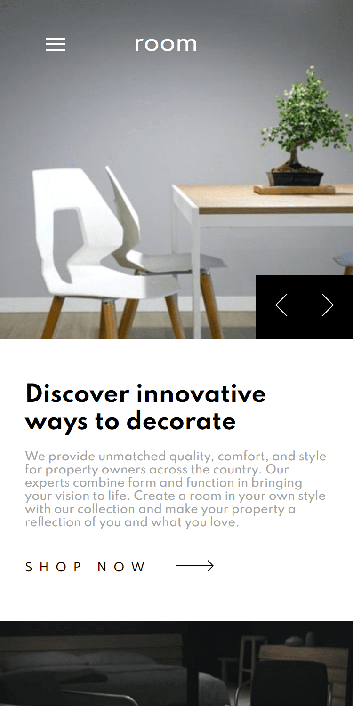

# Frontend Mentor - Room homepage solution

This is a solution to the [Room homepage challenge on Frontend Mentor](https://www.frontendmentor.io/challenges/room-homepage-BtdBY_ENq). Frontend Mentor challenges help you improve your coding skills by building realistic projects. 

## Table of contents

- [Overview](#overview)
  - [The challenge](#the-challenge)
  - [Screenshot](#screenshot)
  - [Links](#links)
- [My process](#my-process)
  - [Built with](#built-with)
  - [What I learned](#what-i-learned)
  - [Continued development](#continued-development)
  - [Challenges](#challenges)
- [Author](#author)
- [Acknowledgments](#acknowledgments)


## Overview

### The challenge

Users should be able to:

- View the optimal layout for the site depending on their device's screen size
- See hover states for all interactive elements on the page
- Navigate the slider using either their mouse/trackpad or keyboard

### Screenshot




### Links

- Solution URL: [Add solution URL here](https://your-solution-url.com)
- Live Site URL: [Add live site URL here](https://efecollins.github.io/room/dist)

## My process

### Built with

- Semantic HTML5 markup
- CSS custom properties
- Flexbox
- Sass

### What I learned

I really can call this project one of my hardest some things were funny to me and most were trickish. Well, instead of learning many new things. I am having troubles with things. Well, just check the live site and you'll figure it out in no time. Don't forget to check the mobile version.

### Continued development

I really would love to focus on more of these;

- JavaScript.
- Navigations.
- Sass.
- Many more things that you can suggest for me. Send me a mail @ [My mailbox](efejamb@gmail.com)

### Challenges

The challenges I faced while building this wonderful room project were frustrating but I call on anyone to help me with them

- I was unable to do some fancy transitions on my hover state of the menu items.
- Yes, I couldn't change the color of this ` SVG ` on hover state. The ` SVG ` was nested in an ` img ` tag. This is the code block.
```html

```
- For the mobile, the navigation after clicking on the hamburger, there was nothing fo me to do to make the menu go away after clicking it again. Simply put, the toggle wasn't functioning.
Thanks.

## Author

- Website - [Efosa Collins Evbowe](https://efecollins.github.io/new-pweb/dist)
- Frontend Mentor - [@efecollins](https://www.frontendmentor.io/profile/efecollins)
- Twitter - [@EfeCollins7](https://www.twitter.com/EfeCollins7)
- Github - [efecollins](https://github.com/efecollins)

## Acknowledgments

My acknowledgements goes to the Almighty God who created me for His PLEASURE (Revelation. 4:11)

- Receive Jesus today. He loves you more than anything and He wants your soul to blossom than to suffer. Please do receive Him, He's arms is wide open to receive you. (Jeremiah. 29:11)
